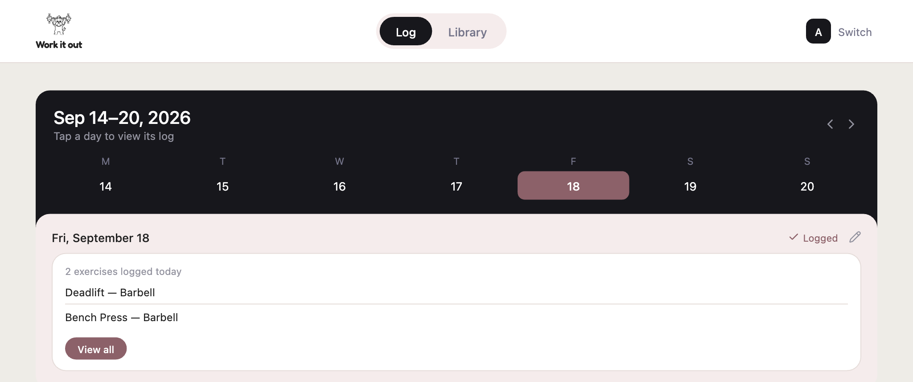
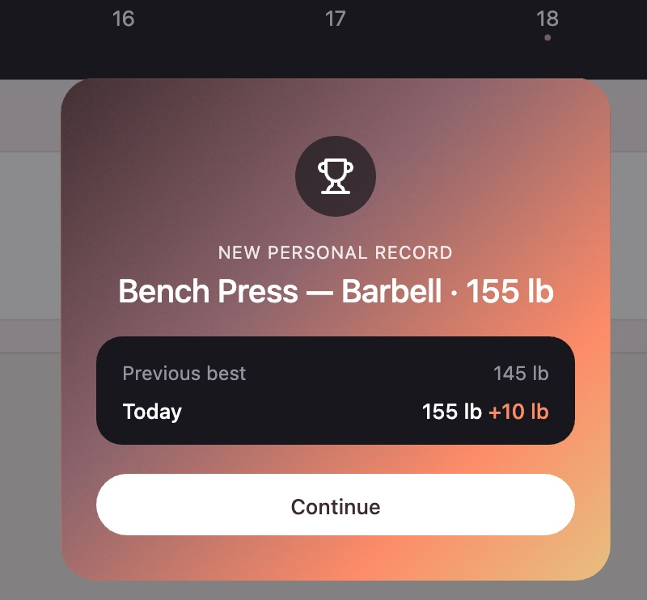
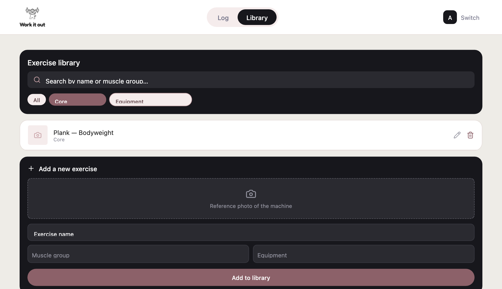

<p align="center">
  
</p>

<h1 align="center">Work It Out</h1>

<p align="center">
  
  
  
  
</p>

Work It Out is a simple workout tracker built for a household to share. Instead of jotting down sets and reps in a notes app, you pick a profile, log your exercises for the day, and save. It keeps a history of your workouts, tracks personal records, and celebrates streaks when you keep showing up.

It was built as a self hosted app for two people, but it works fine for more, since each profile keeps its own separate log.

## What it does

When you open the app, you pick who is training (a simple profile picker, there is no password, this app is meant to run on a private home network, not the open internet).

From there you land on the Log screen, which shows a week at a time. Pick a day, add the exercises you did, and enter your sets. Each set has a weight and a rep count. When you add a set, the app fills in the weight from your last set as a starting point, and once you have logged an exercise before, it will suggest your best ever weight for it.

Nothing is saved until you press "Save workout." This is on purpose, so you can freely add, remove, or fix numbers before committing the day. Saving replaces the whole day in one go, so you never end up with half saved data.

<p align="center">
  
</p>

If you beat your previous best weight on an exercise, or if you hit a logging streak (every 7 days in a row), the app throws up a little celebration screen.

<p align="center">
  
</p>

The Library screen is where the exercises live. You can search and filter by muscle group or equipment, add your own new exercises with a photo, rename existing ones, or remove ones you no longer use (removing an exercise from the library does not delete your past history with it, it just retires it from search).

<p align="center">
  
</p>

The library comes pre loaded with a large set of exercises so you are not starting from zero, see the acknowledgments section below for where those came from.

## How it's built

- Backend: FastAPI (Python) talking to PostgreSQL
- Frontend: React with Vite, no CSS framework, just a shared set of design tokens
- Everything runs through Docker Compose, so you do not need Python or Node installed on your machine to try it out

## Running it on your computer

You will need Docker installed and running. That is the only requirement.

1. Copy the example environment file and fill it in.

```bash
cp .env.example .env
```

Open `.env` in a text editor and set your own password for `POSTGRES_PASSWORD`, then update `DATABASE_URL` to match. Do not use the example password for anything beyond your own local testing.

2. Start everything up.

```bash
docker compose up -d --build
```

This starts three containers, the database, the backend, and the frontend. The first run will take a minute while it builds and loads the exercise library.

3. Open the app.

Go to `http://localhost:5174` in your browser. The backend API lives at `http://localhost:8001`, and you can see its interactive docs at `http://localhost:8001/docs`.

4. Stopping it.

```bash
docker compose down
```

Your data stays in a Docker volume between runs. If you ever want to wipe everything and start fresh with just the seed data, run:

```bash
docker compose down
docker volume rm workout-tracker_pgdata
docker compose up -d
```

## A note on exercise photos

This repository does not include the exercise thumbnail photos. The exercise names, muscle groups, equipment, and step by step instructions came from [hasaneyldrm/exercises-dataset](https://github.com/hasaneyldrm/exercises-dataset) on GitHub and are shared under that project's MIT license, so those are included here as seed data. The photos that go with them belong to Gym Visual and are not covered by that license, so they are left out of this repo. Without them, exercises in the library just show a placeholder icon instead of a photo, everything else still works the same. If you want photos, you can add your own to any exercise from the Library screen.

## Acknowledgments

Diana, for shaping how this app actually works and looks, from the profile picker down to the little celebration screen when you hit a new PR. Co author on this project.

Thank you to [hasaneyldrm](https://github.com/hasaneyldrm) for putting together the exercises-dataset that this app's exercise library is built from.
